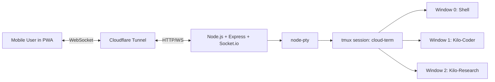

# 02_MDD.md — Module/Master Design Document (MDD)

## 1. High-Level Architecture
Cloud Terminal follows a browser-to-VPS architecture:

- **Frontend (PWA):** React + xterm.js client for terminal rendering and user controls.
- **Edge Tunnel:** Cloudflare Tunnel terminates HTTPS and forwards HTTP/WS.
- **Backend API/Socket Layer:** Node.js + Express + Socket.io.
- **Terminal Runtime Layer:** node-pty process attached to tmux session.
- **Host Environment:** Ubuntu VPS with tmux-managed windows for shell/agents.

### Architecture (Logical)

## 2. Module Breakdown

### 2.1 Frontend Module
Responsibilities:
- Render terminal output stream.
- Capture keyboard/virtual-keyboard input.
- Emit resize events.
- Provide sidebar window switch actions.
- Handle simple lock screen/token input.

Key dependencies from brief:
- `xterm.js`
- `xterm-addon-fit`
- React (Vite), Tailwind CSS

### 2.2 Backend Module
Responsibilities:
- Initialize tmux session on startup if absent.
- Accept WebSocket connections with handshake auth check.
- Spawn PTY attached to `tmux attach -t cloud-term`.
- Bridge Socket input/output to PTY streams.
- Handle PTY resize and control/window-switch commands.

Key dependencies from brief:
- Node.js
- Express
- Socket.io
- node-pty

### 2.3 Session/Agent Mapping Module
Responsibilities:
- Represent “agents” as tmux windows by index/name.
- Query/list windows and expose to frontend.
- Trigger `tmux select-window` actions based on UI selections.

## 3. Database Schema
No database is explicitly required in the provided brief.

### Current MVP Data Strategy
- Session persistence delegated to tmux process state.
- Agent identity represented by tmux window metadata.

### Database Requirement Status
- **Relational/NoSQL selection:** `[REQUIRES CLARIFICATION]`
- **Persistent user/account records:** `[REQUIRES CLARIFICATION]`
- **Audit/event storage:** `[REQUIRES CLARIFICATION]`

## 4. Data Models (Logical)

| Model | Fields | Source of Truth |
|---|---|---|
| TerminalSession | `name` (e.g., `cloud-term`), `exists` | tmux runtime |
| TerminalWindow | `index`, `name`, `active` | tmux window list |
| SocketConnection | `socketId`, `authorized`, `cols`, `rows` | backend memory/runtime |
| AuthToken | `value` (hardcoded/simple) | backend configuration |

## 5. API / Event Contract
The brief is socket-first; endpoints below include explicit placeholders where unspecified.

### 5.1 WebSocket Events (Primary)
| Direction | Event | Payload | Purpose |
|---|---|---|---|
| Client -> Server | `terminal:input` | `{ data: string }` | Send keystrokes/virtual key bytes to PTY |
| Server -> Client | `terminal:output` | `{ data: string }` | Stream terminal output to xterm |
| Client -> Server | `terminal:resize` | `{ cols: number, rows: number }` | Resize PTY |
| Client -> Server | `session:switch` | `{ windowIndex: number }` | Switch tmux window |
| Server -> Client | `session:list` | `{ windows: Array<{index:number,name:string,active:boolean}> }` | Populate sidebar windows |

### 5.2 Authentication Handshake
- Middleware checks password/token in socket handshake.
- Token storage and rotation policy: `[REQUIRES CLARIFICATION]`

### 5.3 HTTP Endpoints
- Backend health check endpoint: `[REQUIRES CLARIFICATION]`
- Any REST management endpoints: `[REQUIRES CLARIFICATION]`

