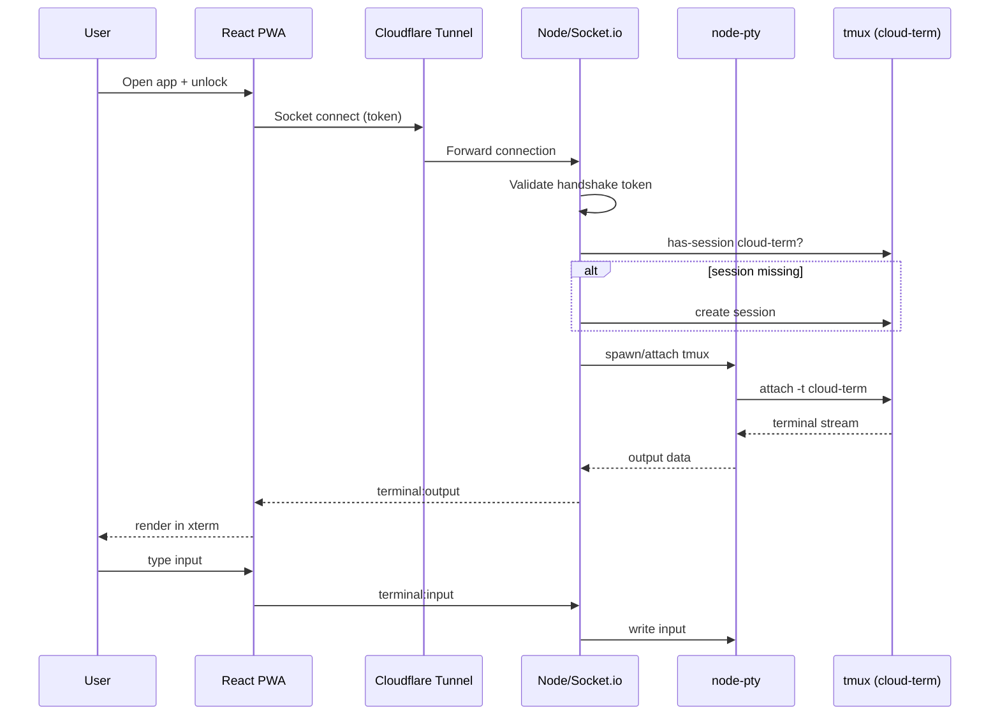
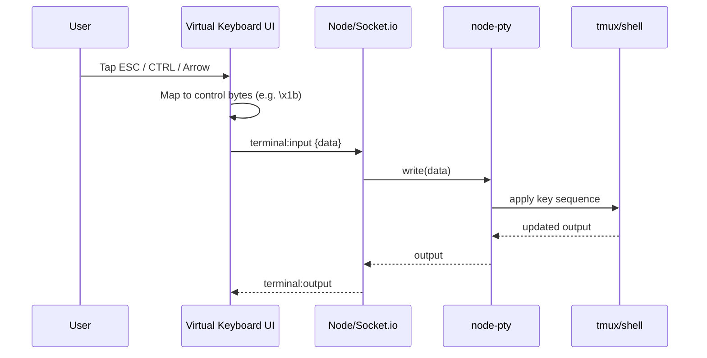
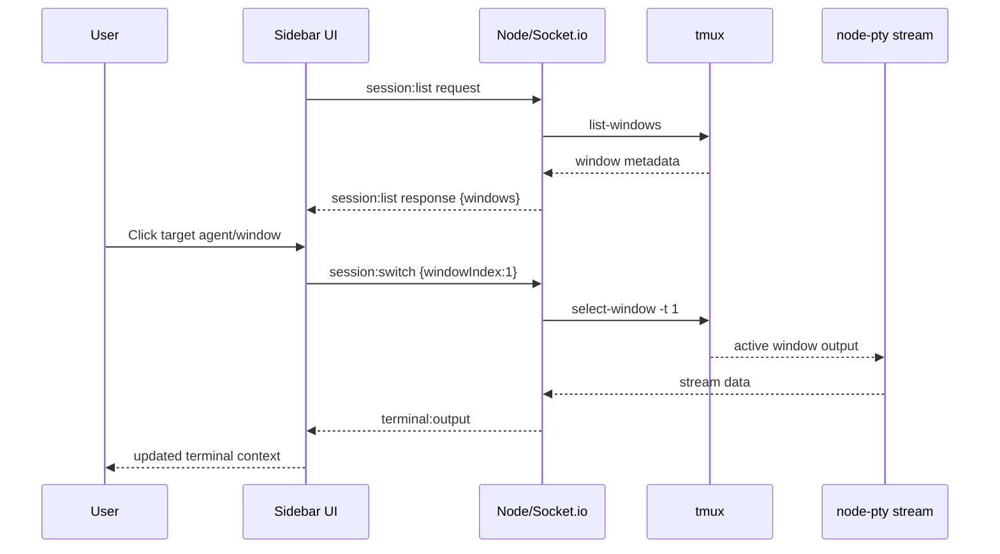

# 03_SSD.md — System Sequence Document (SSD)

This document defines interaction flows for the three core user journeys implied by the project brief.

## Journey 1: Connect and Start Persistent Terminal Session

### Steps

1. User opens PWA on mobile.
2. Frontend prompts for lock/token (if not already unlocked).
3. Frontend establishes Socket.io connection through Cloudflare Tunnel.
4. Backend validates handshake token.
5. Backend ensures `cloud-term` tmux session exists.
6. Backend spawns PTY attached to tmux session.
7. Terminal output begins streaming to frontend xterm.
8. User input is relayed back to PTY in real time.

### Sequence Diagram

## Journey 2: Use Mobile Virtual Keyboard Controls

### Steps

1. User taps a virtual control key (e.g., ESC/CTRL/Arrow).
2. Frontend maps button to control sequence bytes.
3. Frontend sends encoded data to backend via socket.
4. Backend writes bytes to PTY.
5. PTY/tmux process interprets control sequence.
6. Updated terminal output is streamed back.

### Sequence Diagram

## Journey 3: Switch Between Agent Windows (tmux)

### Steps

1. Frontend requests or receives current tmux windows.
2. User clicks agent/window item in sidebar.
3. Frontend emits session-switch intent with target index.
4. Backend executes tmux window select operation.
5. Active stream now reflects selected window context.

### Sequence Diagram

## Clarifications Needed

- Exact socket event names are inferred and may differ from implementation. `[REQUIRES CLARIFICATION]`
- Error-handling flows for failed auth, disconnected PTY, and missing tmux are not explicitly detailed. `[REQUIRES CLARIFICATION]`
